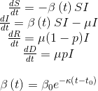
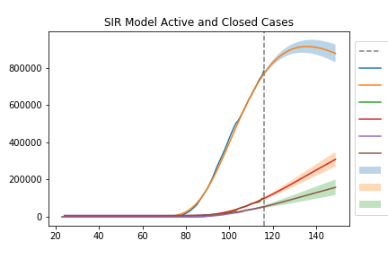
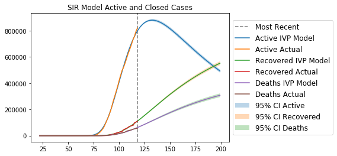

**COVID-19 Model**

This is an SIR model with a time-dependent, exponentially-decaying reproduction number fitted to US cases.

This model is based off data from JHU CSSE at https://github.com/CSSEGISandData/COVID-19.

My model assumes full immunity after infection and continued shelter-in-place orders to drive down the reproduction number.

I used a finite difference model to fit the parameters to existing data, then used an IVP ODE solver to extrapolate the model. I estimated the 95% confidence interval through a Monte Carlo simulation drawing from a multivariate normal distribution using the parameter covariance matrix.

The x-axis represents current day of the year. For reference April 25 is the 116th day of 2020.

Assuming these conditions, peak cases will occur around May 15 with an approximated ~115K deaths by then.

I added a second model that uses the IVP ODE solver to fit and extrapolate.

